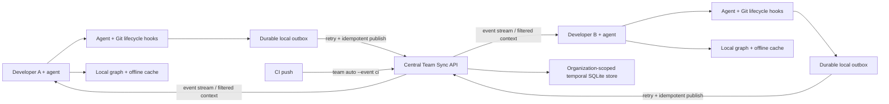

# Team Sync

Team Sync turns each developer's local code graph and agent session into portable,
queryable handoff context. A developer who pulls someone else's work can ask their
own agent what changed, why it changed, which symbols were involved, what decisions
were made, what remains open, and which tests ran.

The shared service stores provenance and graph references, not source files. File
paths are repository-relative, symbol keys are portable across checkouts, and local
absolute paths are rejected at the server boundary.

## What is synchronized

Each **work capsule** can contain:

- repository, branch, base/head SHA, commit metadata, and developer identity;
- agent/client and session identity;
- title, summary, intent, approach, outcome, and status;
- changed files with additions/deletions;
- changed symbols plus bounded callers, callees, and related tests from the local graph;
- decisions, rationale, alternatives, open questions, and test results.

Capsules are idempotent. Republishing the same commit and content creates no extra
event; publishing richer context for that commit updates the capsule and emits a new
event. Clients keep an event cursor and an offline SQLite cache.

## Architecture



The central API is intentionally separate from each checkout's current-state graph.
Local graphs may contain absolute paths and are rebuilt freely; shared capsules are
temporal, portable, organization-scoped records.

## 1. Start the central service

Generate an access token on the host that will run the service:

```bash
code-review-graph team token \
  --db /var/lib/code-review-graph/team.db \
  --organization acme \
  --organization-name "Acme Engineering" \
  --name developers
```

The plaintext token is displayed once. Store it in a secret manager. Then start the
service:

```bash
code-review-graph team serve \
  --db /var/lib/code-review-graph/team.db \
  --host 127.0.0.1 \
  --port 8766
```

Rotate access by creating a new named token, updating clients, and revoking the old
name on the server host:

```bash
code-review-graph team revoke-token \
  --db /var/lib/code-review-graph/team.db \
  --organization acme \
  --name developers
```

For a one-step first boot, pass a token of at least 24 characters with
`--bootstrap-token`. The service uses only the Python standard library and SQLite,
so it can run on a small VM or internal host.

For team or internet access, put the service behind an HTTPS reverse proxy and keep
the Python process bound to `127.0.0.1`. Back up the database together with its WAL
files using a SQLite-safe snapshot strategy. The initial service is designed for one
process; do not run multiple service processes against the same SQLite database.

## 2. Enroll each checkout

```bash
code-review-graph team init \
  --server https://code-context.example.com \
  --token "$CRG_TEAM_TOKEN"
```

The repository key is derived from a credential-free canonical origin identity. SSH and
HTTPS clones normalize to the same host/path key. Developer
identity comes from `git config user.email` and `user.name`; all values can be
overridden with `--repository-key`, `--developer-id`, `--developer-name`, and
`--developer-email`.

Configuration is written with user-only permissions to the graph data directory's
`team.json`, which is ignored by Git. CI can avoid a file entirely:

```bash
export CRG_TEAM_SERVER=https://code-context.example.com
export CRG_TEAM_TOKEN=...
export CRG_TEAM_REPOSITORY=git:stable-repository-key
export CRG_TEAM_DEVELOPER=ci
```

### Zero-touch enrollment

`code-review-graph install` now installs the automation layer and immediately runs a
session synchronization. For centrally managed developer machines, distribute only:

```bash
export CRG_TEAM_SERVER=https://code-context.example.com
export CRG_TEAM_TOKEN=...
# Optional: omit this to derive it from the credential-free origin URL.
export CRG_TEAM_REPOSITORY=git:stable-repository-key
```

The first hook registers the repository and derives the developer from Git config.
Environment tokens are never copied into `team.json`; the local enrollment file stores
only the server, repository, developer, organization, and event cursor. A checkout with
neither `team init` configuration nor these environment variables stays dormant.

## Zero-touch automation

After installation, no publish or sync command is required during normal development:

| Event | Automatic behavior |
|---|---|
| Agent session start | Retry queued publications, then download team events |
| Agent file edit | Update the local graph and checkpoint current tracked/untracked work |
| `pre-commit` | Capture the latest working tree alongside the existing risk check |
| `post-commit` | Publish the new commit with commit-author attribution |
| Pull/merge (`post-merge`) | Backfill `ORIG_HEAD..HEAD`, then synchronize context |
| Branch checkout | Retry the outbox and synchronize context |
| Rebase/amend (`post-rewrite`) | Publish rewritten commits from `ORIG_HEAD..HEAD` |
| `pre-push` | Publish the upstream-to-HEAD range before it leaves the machine |

Git hooks are installed for every supported platform, so editors without native event
hooks still get commit, pull, checkout, rebase, and push coverage. Native edit/session
hooks are installed for Codex, Claude, Qoder, CodeBuddy, Cursor, Gemini CLI, and
OpenCode.

Every payload is committed to `.code-review-graph/team-cache.db` before the first HTTP
request. Hooks always exit successfully. If the service is down, the entry remains in
the outbox and is retried at later lifecycle events with a short backoff. A capsule the
server permanently rejects (an HTTP 4xx other than authentication or throttling), or one
that keeps failing after 20 attempts, is dead-lettered instead of retried forever; it
stays inspectable via `team status` and re-enters the queue when its content changes.
Automatic
working-tree checkpoints coalesce into one record per repository, developer, branch, and
local checkout;
the newest offline edit replaces the older queued snapshot instead of creating an
unbounded stream. When that work is committed, the checkpoint is closed and linked to the
commit. Commits remain immutable, idempotent records. Unborn repositories are supported
before their first commit.

Inspect or force the queue when debugging:

```bash
code-review-graph team status          # includes outbox_count and dead letters
code-review-graph team auto --event flush
```

Tune hook latency with `CRG_TEAM_AUTO_TIMEOUT` (default 3 seconds, bounded from
0.25–15) and edit checkpoint frequency with `CRG_TEAM_CHECKPOINT_SECONDS` (default
60 seconds). The latest checkpoint is still written to the outbox immediately; the
interval only limits network publication.

The automatic layer records facts Git and the graph can prove: authorship, commit
messages, files, symbols, dependencies, tests linked by the graph, and lifecycle state.
Agent-authored `intent`, `approach`, decisions, questions, and test outcomes remain an
additive richer handoff through `publish_work_capsule_tool` or `team publish`; automation
does not invent rationale.

Existing POSIX shell hooks are preserved and automation is inserted before user commands,
so an early `exit` cannot bypass it. Hooks using Python, Node, or another interpreter are
wrapped; the original executable is preserved beside the wrapper and restored by
`code-review-graph uninstall`.

See [Team Sync validation](TEAM_SYNC_VALIDATION.md) for the two-developer risk model,
tested lifecycle matrix, rollout checklist, and explicit production boundaries.

## 3. Publish work

Agents can call `publish_work_capsule_tool` directly. The equivalent CLI commands are:

```bash
# Publish the current commit. Commit subject/body provide a useful default summary.
code-review-graph team publish --commit HEAD --agent codex \
  --decision "Kept compatibility with v1 payloads" \
  --test "pytest=passed"

# Hand off unfinished work, including staged, unstaged, and untracked files.
code-review-graph team publish --working-tree \
  --summary "Parser works; retry behavior still needs tests" \
  --intent "Add resilient webhook parsing" \
  --approach "Separated decoding from validation" \
  --question "Should malformed signatures retry?" \
  --status in_progress \
  --agent claude
```

No source contents or patches are uploaded. If the local graph exists, changed line
ranges are mapped to symbols and impact edges. Without a graph, every changed file is
still published as a file-level symbol.

To backfill an existing history or publish all commits from a CI push:

```bash
code-review-graph team import --range 'origin/main~20..origin/main'
```

`team import` processes commits oldest first, is capped by `--max-commits`, and uses
each commit's author as its developer identity. Re-running it is safe.

For CI, the fail-open automation entry point provides the same durable/idempotent path:

```bash
code-review-graph team auto --event ci --range "$BEFORE_SHA..$AFTER_SHA" --agent ci
```

## 4. Consume context from another agent

The MCP server exposes focused tools so the receiving agent does not need to scan the
repository or reconstruct intent from diffs:

- `get_developer_context_tool(developer="priya@example.com")`
- `get_symbol_history_tool(symbol="src/auth.py::AuthService.login")`
- `get_team_context_tool(commit="a1b2c3d")`
- `list_team_activity_tool()`
- `sync_team_context_tool()`
- `team_sync_status_tool()`

CLI equivalents are useful for automation and debugging:

```bash
code-review-graph team context --developer priya@example.com
code-review-graph team context --symbol 'src/auth.py::AuthService.login'
code-review-graph team context --commit a1b2c3d
code-review-graph team activity
code-review-graph team sync
code-review-graph team status
```

Add `--offline` to context or activity queries to force the local cache. Online
queries automatically fall back to that cache when the central service is unavailable.

## Agent workflow

When fixing or extending pulled code, an agent should:

1. Query `get_symbol_history_tool` for the target symbol or file.
2. If a capsule identifies the author, query `get_developer_context_tool` for nearby work.
3. Read the capsule's intent, approach, decisions, open questions, tests, and impact edges.
4. Use the local graph for current source and dependency details.
5. Publish a new capsule when the fix is complete or when handing off unfinished work.

This preserves the division of responsibility: the central history explains human and
agent intent over time, while the local graph remains the authority for current code.

## API

All endpoints use JSON. Except for health, they require
`Authorization: Bearer <token>` and are isolated to the token's organization.

| Method | Endpoint | Purpose |
|---|---|---|
| `GET` | `/v1/health` | Service health |
| `GET/POST` | `/v1/repositories` | List or register repositories |
| `POST` | `/v1/capsules` | Idempotently create/update a work capsule |
| `GET` | `/v1/capsules/{id}` | Retrieve one capsule |
| `GET` | `/v1/events?repository=...&after=...` | Incremental synchronization |
| `GET` | `/v1/context?repository=...` | Filter by developer, symbol, commit, or time |
| `GET` | `/v1/activity?repository=...` | Recent capsules and per-developer counts |

Requests are limited to 2 MiB and query limits are bounded. Tokens are stored centrally
as SHA-256 hashes and compared in constant time. Use a different organization/token for
tenants that must not see one another's data.

## Current boundaries

- The server is a lightweight, single-process SQLite deployment, not a horizontally
  scaled hosted control plane.
- Access tokens grant organization-wide access; per-repository roles and SSO are not
  part of protocol version 1.
- Capsule narratives come from commit messages, CLI flags, or agents. Git can recover
  what changed, but it cannot reconstruct design intent that was never recorded.
- Deleting or expiring shared history is intentionally not exposed in version 1; manage
  retention through controlled database backups/migrations until policy APIs are added.
